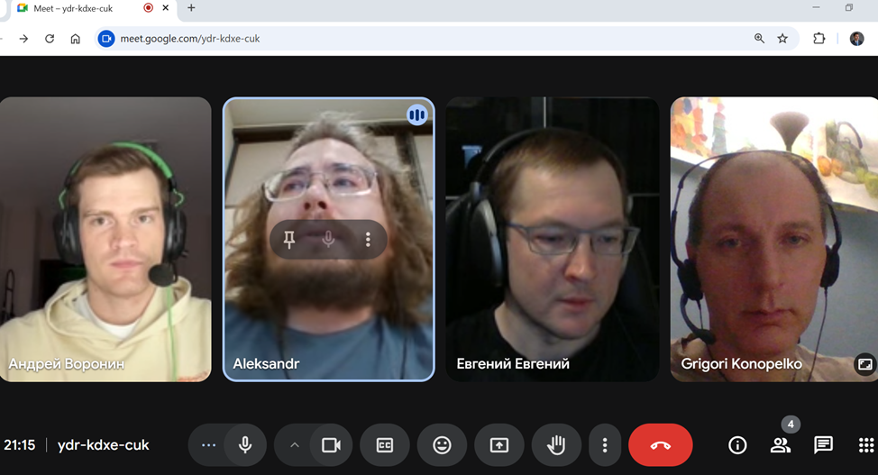

# eCommerce-Application [link](https://github.com/sashapervykh/eCommerce-Application)

[task](https://github.com/rolling-scopes-school/tasks/tree/master/tasks/eCommerce-Application)

[taskboard](https://github.com/users/sashapervykh/projects/1/views/1)

This is the final project of RS School 2025. Tis is API client integrated with CommerceTools. The application is developed in team of three students 👨‍💻👩‍💻👨‍💻 and their mentor:

- mentor Andrey Voronin [AVor0n](https://github.com/AVor0n)
- Aleksandr Pervykh [sashapervykh](https://github.com/sashapervykh)
- Evgeniy Smirnov [maxnope](https://github.com/maxnope)
- Grigori Konopelko [gkonopelko](https://github.com/gkonopelko)

## About eCommerce Application 🛍️🌐

Welcome to our eCommerce application! This platform replicates real-world shopping experiences in a digital environment 🏪. It's a comprehensive online shopping portal that provides an interactive and seamless experience to users. From product discovery to checkout, the application ensures a smooth journey for the user, enhancing their engagement and boosting their purchasing confidence 🚀.

Users can browse through a vast range of products 📚👗👟, view detailed descriptions, add their favorite items to the basket 🛒, and proceed to checkout 💳. It includes features such as user registration and login 📝🔐, product search 🔍, product categorization, and sorting to make the shopping experience more streamlined and convenient.

An important aspect of our application is that it's responsive 📲, ensuring it looks great on various devices with a minimum resolution of 390px. This feature makes the shopping experience enjoyable, irrespective of the device users prefer.

Key pages in the application include:

-   Login and Registration pages 🖥️
-   Main page 🏠
-   Catalog Product page 📋
-   Detailed Product page 🔎
-   User Profile page 👤
-   Basket page 🛒
-   About Us page 🙋‍♂️🙋‍♀️
    The application is powered by CommerceTools 🌐.

## Purpose of the Project

To try real interaction in a team using the example of creating a joint project using a task board and GitHub sharing tools.
The central focus of this Project is on the team dynamics and collaborative efforts that contributed to the project's success, rather than merely the project's technical aspects.

## Technology Stack 💻📚

The decision on whether to use a framework for the project was hard for us because we don't have experience with framework. We decided to try React ⚛️, but we have the option to proceed without a framework too.

1. TypeScript is mandatory for this project. It ensures type safety and improve the maintainability and scalability of the application 📘.
2. The application is a Single Page Application (SPA) with an empty index.html 🗂️.
3. Our application have its own unique data set to enhance uniqueness and provide a novel user experience. 🚫📊💡
4. We use Vite for the project.
5. We also use ESLint, Prettier, Husky, and Jest for testing.

## Prepare and use

1. Install Node.js
2. Fork this repository: https://github.com/sashapervykh/eCommerce-Application
3. Clone your newly created repo.
4. To install all dependencies use `npm install`

## Available scripts

-   "start": to start webpack server,
-   "build": to build page with webpack,
-   "lint": to start eslint check,
-   "lint:fix" to fix eslint problems,
-   "prettier": to start prettier,
-   "prepare": to start husky

## Our project in commercetools

[merchant center](https://mc.us-central1.gcp.commercetools.com/space-real-estate/welcome)

